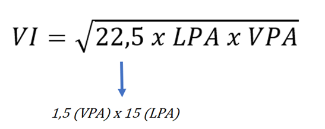

# A Fórmula de Graham
Benjami Graham buscou simplificar o cálculo do valor intrínseco de uma ação através da seguinte fórmula abaixo:

#### Sendo:
* VI = Valor Intrínseco;
* 22,5 = Constante;
* LPA = Lucro por Ação; 
* VPA = Valor Patrimonial por Ação.

###Quem é Benjamin Graham

Benjamin Graham é um dos maiores investidores de todos os tempos e – muito provavelmente – o personagem mais influente 
da área.Revolucionando algumas ideias básicas de como se portar na hora de fazer investimentos e criando novos métodos 
de análise, Benjamin influenciou diretamente uma geração de investidores de sucesso.
Warren Buffett, que para muitos é o maior investidor de todos os tempos, é provavelmente o maior exemplo do peso que 
Graham tem na história. O modelo de sucesso de Buffett é consequência direta dos seguimentos compartilhados por Benjamin 
Graham.

Com 20 anos, Benjamin se formou em economia com brilhantismo, no período até teve a oportunidade de iniciar sua carreira 
no ramo acadêmico, porém preferiu encarar Wall Street, sua carreira se iniciou na empresa Newburguer, Henderson and Loeb,
o início de sua trajetória também é marcado pela criação da Graham-Newman,negócio formado em pareceria com Jerry Newman.
Em 1928, assume posto de professor na Faculdade de Columbia,nesse período ele conhece e dá aulas para David Dodd, Dodd 
foi seu parceiro na criação de seus dois livros de maior sucesso: Security Analysis (1934) 
e The Intelligent Investor (1949) os livros de Benjamin Graham são difundidos até hoje. Sendo que o Security Analysis 
é considera a bíblia dos investidores sérios.

Tratando de conceitos inovadores para época, Graham traz uma nova forma de entender o universo dos investimentos e de 
como encarar os atores presentes na área, as frases de Benjamin Graham também são divulgadas até hoje. Talvez a mais 
marcante seja sua defesa do quanto o mercado de ações é volátil.
####“As pessoas não conseguem prever o que irá acontecer no mercado de ações”.
Com isto Benjamin separou a figura do investidor com o especulador.

* Nome Completo: Benjamin Graham
* Local de Nascimento: Londres, Inglaterra
* Nacionalidade: Inglês
* Formação: Economia
* Nascimento: 08/05/1894
* Data de Falecimento: 21/09/1976 (62 anos)

Fonte: https://www.suno.com.br/tudo-sobre/benjamin-graham/ 
30-09-2021.
